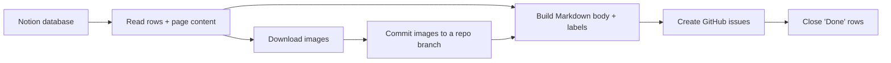

<!-- jr-brand:start -->
<div align="center">
  <a href="https://jannikreinhard.com/">
    
  </a>
  <h1>Notion to GitHub</h1>
  <p><strong>CLI to migrate Notion database entries to GitHub issues, including text, labels, images, dry runs and status-based closing.</strong></p>
  <p>
  <a href="https://jannikreinhard.com/"></a>
  <a href="https://github.com/JayRHa"></a>
  <a href="https://www.linkedin.com/in/jannik-r/"></a>
  <a href="https://x.com/jannik_reinhard"></a>
  <a href="https://www.youtube.com/@ModernDevMgmt/featured"></a>
</p>
  <p><sub>Tool · App · CLI · Python · Practical by design</sub></p>
</div>
<!-- jr-brand:end -->

## Overview

`notion-to-github` reads a Notion database and turns every row into a GitHub issue.
The row title becomes the issue title, the page content (text **and images**) becomes
the issue body, and any Notion property you pick becomes a label. Optionally it closes
issues that are already "Done".

No pip packages. Just Python, `git` and the GitHub CLI.

## How It Works



Images are committed to a branch of your target repo and linked with raw URLs, so they
render **inline inside the issue — even for private repos** (where external image links don't work).

## Quickstart

1. Clone the repository:

   ```bash
   git clone https://github.com/JayRHa/notion-to-github.git
   cd notion-to-github
   ```

2. Continue with the setup below.

## Prerequisites

- **Python 3.9+** (no extra packages needed)
- **git**
- **GitHub CLI** logged in: `gh auth login`

## Setup (one time)

1. Create a Notion integration → https://www.notion.so/my-integrations
   - Type **Internal**, capability **Read content**, copy the token (`ntn_...`).
2. Open your Notion database → `•••` → **Connections** → add your integration.
3. Grab the **database ID** — the 32-character part of the database URL:

   ```
   https://notion.so/<workspace>/<DATABASE_ID>?v=...
   ```

## Use it (the simple way)

```bash
export NOTION_TOKEN="ntn_xxx"

python3 notion_to_github.py \
  --database 5ae1efa98d60838289eb010ca1f26580 \
  --repo myname/myrepo
```

That's it. Every row becomes an issue, images included.

## Use it (with labels and auto-close)

```bash
python3 notion_to_github.py \
  --database <DATABASE_ID> \
  --repo myname/myrepo \
  --label-prop Typ \
  --label-prop Status \
  --status-prop Status \
  --close-status Done
```

- `--label-prop Typ` → the value of the "Typ" column becomes a label (repeat for more columns).
- `--status-prop Status --close-status Done` → rows where "Status" is "Done" are created **and immediately closed**.

## Preview first (creates nothing)

```bash
python3 notion_to_github.py --database <DATABASE_ID> --repo myname/myrepo --dry-run
```

## Options

| Flag | Purpose | Default |
| --- | --- | --- |
| `--token` | Notion token (or set `NOTION_TOKEN`) | env var |
| `--database` | Notion database ID | required |
| `--repo` | Target repo `owner/name` | required |
| `--label-prop` | Notion property → label (repeatable) | none |
| `--status-prop` | Property used to detect "done" rows | none |
| `--close-status` | Close rows whose status equals this | none |
| `--image-branch` | Branch that stores the images | `notion-assets` |
| `--assets-dir` | Folder in the repo for images | `notion-assets` |
| `--no-images` | Skip images entirely | off |
| `--dry-run` | Render everything, create nothing | off |

## Notes

- The image branch (`notion-assets` by default) must stay in the repo — deleting it removes the
  images from your issues.
- The title is taken automatically from the database's title column; no flag needed.
- Re-running creates issues again (no dedup) — use `--dry-run` to check first.

## Security

- Never commit your Notion token. Use `NOTION_TOKEN`.
- Delete or rotate the integration when you're done: https://www.notion.so/my-integrations

## License

This project is available under the terms in [LICENSE](LICENSE).

<!-- jr-brand-footer:start -->

---

<div align="center">
  <p><sub>Built and maintained by <a href="https://jannikreinhard.com/">Jannik Reinhard</a> · Microsoft MVP for Security and AI Platform.</sub></p>
  <p><a href="https://www.buymeacoffee.com/jannikreinf">Support the open-source work</a></p>
  <p><strong>Stay healthy, Cheers Jannik</strong></p>
</div>

<!-- jr-brand-footer:end -->
