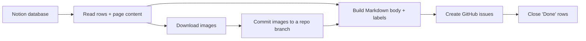

<!-- unified-readme:start -->
<div align="center">

# Notion to GitHub

**CLI tool to migrate a Notion database into GitHub issues — text, labels and images included.**

Build. Automate. Share.

[](https://github.com/JayRHa/notion-to-github/stargazers)
[](https://github.com/JayRHa/notion-to-github/network/members)
[](https://github.com/JayRHa/notion-to-github/issues)
[](https://github.com/JayRHa/notion-to-github/graphs/contributors)

<h1>Notion to GitHub</h1>
  <p><strong>One Notion database. One command. All your tasks as GitHub issues.</strong></p>
  <p>
    
    
    
    
  </p>

<p>
  <a href="https://jannikreinhard.com/">Blog</a> ·
  <a href="https://www.linkedin.com/in/jannik-r/">LinkedIn</a> ·
  <a href="https://x.com/jannik_reinhard">X</a>
</p>

---

`CLI Tool` | `Python` | `Public` | `Maintained`

</div>

## What is this?

`notion-to-github` reads a Notion database and turns every row into a GitHub issue.
The row title becomes the issue title, the page content (text **and images**) becomes
the issue body, and any Notion property you pick becomes a label. Optionally it closes
issues that are already "Done".

No pip packages. Just Python, `git` and the GitHub CLI.

## How It Works



Images are committed to a branch of your target repo and linked with raw URLs, so they
render **inline inside the issue — even for private repos** (where external image links don't work).

## Quick Start

1. Clone the repository:

   ```bash
   git clone https://github.com/JayRHa/notion-to-github.git
   cd notion-to-github
   ```

2. Continue with the setup below.

---
<!-- unified-readme:end -->

## Prerequisites

- **Python 3.9+** (no extra packages needed)
- **git**
- **GitHub CLI** logged in: `gh auth login`

## Setup (one time)

1. Create a Notion integration → https://www.notion.so/my-integrations
   - Type **Internal**, capability **Read content**, copy the token (`ntn_...`).
2. Open your Notion database → `•••` → **Connections** → add your integration.
3. Grab the **database ID** — the 32-character part of the database URL:

   ```
   https://notion.so/<workspace>/<DATABASE_ID>?v=...
   ```

   > **Tip:** you can pass the whole URL to `--database` and the tool extracts the ID
   > for you. Just make sure you use the **database ID** (the part *before* `?v=`),
   > not the `v=` **view ID** — passing the view ID causes `object_not_found`.

## Use it (the simple way)

```bash
export NOTION_TOKEN="ntn_xxx"

python3 notion_to_github.py \
  --database 5ae1efa98d60838289eb010ca1f26580 \
  --repo myname/myrepo
```

That's it. Every row becomes an issue, images included.

Both `--database` and `--repo` also accept a full URL, so you can copy-paste
straight from the browser:

```bash
python3 notion_to_github.py \
  --database "https://www.notion.so/<workspace>/<DATABASE_ID>?v=<VIEW_ID>" \
  --repo "https://github.com/my-org/my-repo"
```

> **Organizations:** always include the owner in `--repo` (e.g. `my-org/my-repo`
> or the full URL). A bare name like `--repo my-repo` is rejected because `gh`
> would otherwise assume your personal account and fail for org-owned repos.

## Use it (with labels and auto-close)

```bash
python3 notion_to_github.py \
  --database <DATABASE_ID> \
  --repo myname/myrepo \
  --label-prop Typ \
  --label-prop Status \
  --status-prop Status \
  --close-status Done
```

- `--label-prop Typ` → the value of the "Typ" column becomes a label (repeat for more columns).
- `--status-prop Status --close-status Done` → rows where "Status" is "Done" are created **and immediately closed**.

## Use it (with mapping.json for labels, assignees and status)

Instead of (or in addition to) `--label-prop` / `--status-prop`, you can create a
`mapping.json` file that maps Notion property values to GitHub labels, assignees,
and open/closed state with full 1:1 control.

A sample `mapping.json` is included in the repo — edit it to match your database:

```json
{
  "label": {
    "property": "category",
    "map": { "Bug": "bug", "Feature request": "enhancement" }
  },
  "assignees": {
    "property": "responsible",
    "map": { "Notion Display Name": "github-username" }
  },
  "status": {
    "property": "status",
    "map": { "Backlog": "open", "In Progress": "open", "Done": "closed", "Cancelled": "closed:not planned" }
  },
  "issue_fields": {
    "Priority": {
      "property": "priority",
      "map": { "Urgent": "Critical", "High": "High", "Medium": "Medium", "Low": "Low" }
    },
    "tag": {
      "property": "tag",
      "map": { "Notion Tag A": "GitHub Option A", "Notion Tag B": "GitHub Option B" }
    }
  }
}
```

Each section is optional — include only the ones you need.

| Section | Notion property | GitHub target | Unmapped values |
| --- | --- | --- | --- |
| `label` | `category` (or any property) | Issue labels | Passed through as-is with a warning |
| `assignees` | `responsible` (or any `people` property) | Issue assignees | Skipped with a warning |
| `status` | `status` (or any property) | Open/closed state | Skipped with a warning |
| `issue_fields.*` | Any property | Org-level issue field (e.g. Priority, tag) | Skipped with a warning |

**Status values:** use `"open"`, `"closed"` / `"completed"` (closes with reason
*completed*), or `"closed:not planned"` / `"not planned"` (closes with reason
*not planned*). Case-insensitive.

**Issue fields:** the `issue_fields` section is a dict where each key is the exact
GitHub issue field name and the value has `"property"` (Notion column) and
`"map"` (value mapping). Mapped values must exactly match the option names of the
corresponding `single_select` field in your org. For `text` fields you can omit
`"map"` and the raw Notion value is pushed directly. Multi-select Notion properties
use the first mapped value (GitHub single-select fields only hold one).

The tool auto-discovers field IDs at startup. To see your org's available fields:

```bash
gh api /orgs/YOUR-ORG/issue-fields \
  -H "X-GitHub-Api-Version: 2026-03-10" \
  --jq '.[] | {name, content_type, options: [.options[]?.name]}'
```

> **Note:** the legacy `"priority"` top-level section still works and is
> automatically promoted to `issue_fields["Priority"]`.

By default the tool looks for `./mapping.json` in the working directory. Use
`--mapping path/to/file.json` to point elsewhere.

```bash
python3 notion_to_github.py \
  --database <DATABASE_ID> \
  --repo my-org/my-repo \
  --mapping my-mapping.json
```

## Update existing issues (backfill fields without duplicating)

If you already imported issues and want to push additional issue field values
(e.g. a `tag` you forgot), use `--update-existing`. This mode **never creates
issues** — it matches Notion rows to existing issues by title and only sets the
`issue_fields` values from the mapping.

Preview first (safe, changes nothing):

```bash
python3 notion_to_github.py \
  --database <DATABASE_ID> \
  --repo my-org/my-repo \
  --update-existing --dry-run
```

Then run for real:

```bash
python3 notion_to_github.py \
  --database <DATABASE_ID> \
  --repo my-org/my-repo \
  --update-existing
```

Rows that don't match an existing issue title are skipped with a log message.

## Preview first (creates nothing)

```bash
python3 notion_to_github.py --database <DATABASE_ID> --repo myname/myrepo --dry-run
```

## Options

| Flag | Purpose | Default |
| --- | --- | --- |
| `--token` | Notion token (or set `NOTION_TOKEN`) | env var |
| `--database` | Notion database ID or database URL | required |
| `--repo` | Target repo `owner/name` or GitHub URL | required |
| `--mapping` | Path to `mapping.json` for labels, assignees, status, issue fields | `mapping.json` |
| `--update-existing` | Match issues by title, set field values only (no creation) | off |
| `--label-prop` | Notion property → label (repeatable) | none |
| `--status-prop` | Property used to detect "done" rows | none |
| `--close-status` | Close rows whose status equals this | none |
| `--image-branch` | Branch that stores the images | `notion-assets` |
| `--assets-dir` | Folder in the repo for images | `notion-assets` |
| `--no-images` | Skip images entirely | off |
| `--dry-run` | Render everything, create nothing | off |

## Notes

- The image branch (`notion-assets` by default) must stay in the repo — deleting it removes the
  images from your issues.
- The title is taken automatically from the database's title column; no flag needed.
- Re-running in normal mode creates issues again (no dedup) — use `--dry-run` to check first.
  To backfill fields on already-imported issues without duplicating, use `--update-existing`.
- To bulk delete issues: `gh issue list --repo your-org-name/your-repo --state open --limit 1000 --json number -q '.[].number' | xargs -I {} gh issue delete {} --repo your-org-name/your-repo --yes`

## Security

- Never commit your Notion token. Use `NOTION_TOKEN`.
- Delete or rotate the integration when you're done: https://www.notion.so/my-integrations
